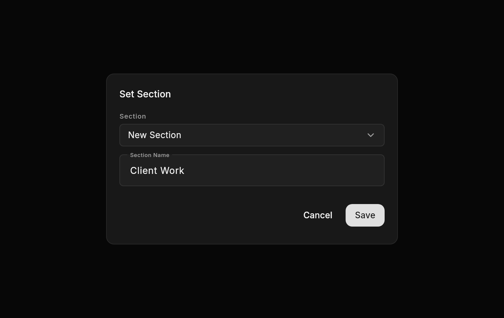

# Workspace Storage

Alera measures a linked workspace on demand before offering manual cleanup. Measurement runs in a sidecar worker rather than on Flutter's main isolate or the terminal-host actor. Directory symlinks are counted but never followed.

Manual removal from the desktop always requires confirmation, including when the workspace is selected or has open tabs. Confirmation authorizes closing all tabs, stopping terminals and their child processes, and discarding unsaved changes. The desktop sends the additive `closeSessions: true` option with both storage measurement and managed removal. Callers that omit this option retain the refusal to remove a selected workspace or one with live terminal sessions. After a linked review is merged, the Pull Request panel defaults to the confirmed Archive Workspace action instead: sessions stop and the workspace hides from the sidebar, while tabs, branch, and files are preserved for resume. Remove Workspace stays in the action menu for workspaces that should be deleted.

Cleanup is still refused when the workspace is owned by an active automation definition or run, belongs to another host, is the main/source repository of any project, has another runtime owner, or resolves outside Alera's configured managed-workspace root. Once accepted, the runtime mutation barrier rejects new owner-creating requests until cleanup completes. Ownership, path containment, and Git worktree branch identity are checked again before stopping sessions and immediately before filesystem mutation. The runtime stops terminal process trees before removing the registered Git worktree and runtime records. A worker waits for process exit without blocking the host actor; on Unix it allows four seconds for graceful shutdown before escalating to SIGKILL, and on Windows it terminates and waits for the session Job Objects. Failure to verify shutdown prevents filesystem deletion. The desktop releases terminal scrollback buffers and editor documents. A failed Git operation leaves the workspace record available for a retry, but already stopped terminal tabs are removed and clients notified; stopped sessions are not restarted automatically. There is no scheduled or automatic cleanup.

If process shutdown fails, the running host retains the pending process identities or Windows handles between attempts and defers automatic idle shutdown. A confirmed retry checks those retained processes as well as any new sessions before deleting files. Legacy callers cannot bypass a pending shutdown by omitting `closeSessions` or removing its workspace/project records through another operation. On Unix, cleanup delays reaping the PTY leader to reserve its process identity while finding remaining members of its OS session, including helpers forked by shutdown handlers after their parents exit. This lease is released once shutdown is verified.

## Measurement Limitations

- Reported bytes are allocated entry lengths from filesystem metadata, not guaranteed physical disk usage. Sparse files, compression, deduplication, copy-on-write clones, filesystem block size, and hard links can make actual reclaimed space differ.
- Directory metadata contributes a small platform- and filesystem-dependent amount.
- Files changing during a scan can make the result approximate. The cleanup request rechecks ownership and path safety, but it does not freeze the filesystem.
- Unreadable or concurrently removed entries fail the scan instead of presenting a cleanup confirmation.
- Windows junctions and other reparse-point behavior depends on Rust's filesystem classification for the installed toolchain. Alera does not follow entries classified as symbolic links, and path containment is still checked using the platform canonical path.

## Workspace Sections

Sections organize workspaces without moving files, changing projects or Parent relationships, or closing tabs and terminal sessions. Desktop and mobile share the section catalog, assignments, grouping preference, section sort, and collapse state through the paired runtime. Select **Section** in **Group By**, then use **Set Section** after the Parent actions on a workspace to select an existing section or create one when saving. **Set Section Tree** and **Clear Section Tree** apply the same assignment to that workspace and every descendant. When fewer than 10 sections exist, **Set Section** and **Set Section Tree** open a submenu of those sections plus **New Section**. Ten or more sections keep the picker dialog. **Clear Section** moves only that workspace to **Others**, the final group, which is hidden when empty.

Custom sections can mix projects. Parent nesting is displayed only within the same section. Pinned workspaces retain their dedicated group and the **Repeat Pinned Workspaces** preference. Sections support Name, Recent (membership changes), and Agent Activity sorting independently of workspace sorting. Searching a section name includes its members, while other filters continue to apply.

**Delete Section** requires confirmation and preserves every workspace. A section is removed automatically when its last member is moved, cleared, or removed, including through project removal. Filters, collapsed groups, and hiding pinned copies never remove assignments. Creating a section and assigning its initial workspace is atomic, so cancelling the dialog creates nothing. Names are trimmed, unique without case distinctions, and cannot be empty or **Others**. Sections belong to one runtime and are not synchronized between separate hosts.

The runtime stores sections and their single-workspace assignments separately from workspace upserts so older clients cannot overwrite membership. The additive **workspaceSectionsV1** capability gates section controls on desktop and mobile without changing either strict protocol version. Older hosts keep the existing None and Project controls. The `alera workspace section` CLI commands list, create, assign, clear, and remove sections through the same host verbs, falling back to the runtime store when no host is connected.

## Workspace Archiving

Archiving hides a workspace from the sidebar without deleting anything. The runtime stops its terminal sessions and marks the workspace archived; tab records, layout, branch, and files are preserved, so agent sessions resume through their stored native session ids when the workspace is unarchived. Sleep works the same way but keeps the workspace visible. Archived workspaces stay hidden unless **Show Archived Workspaces** is enabled in View Options. Archiving never touches git state: the branch is conserved even when it is fully merged, and removal remains a separate confirmed action. The additive **workspaceArchiveV1** capability gates the `workspace.archive` / `workspace.unarchive` verbs and the archive controls on desktop and mobile without changing either strict protocol version. The `alera workspace archive` and `alera workspace unarchive` CLI commands use the same host verbs, falling back to the runtime store when no host is connected.
