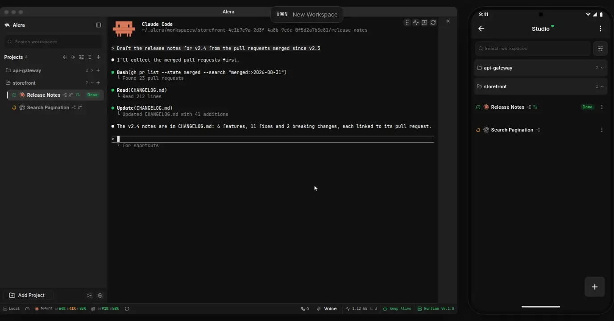
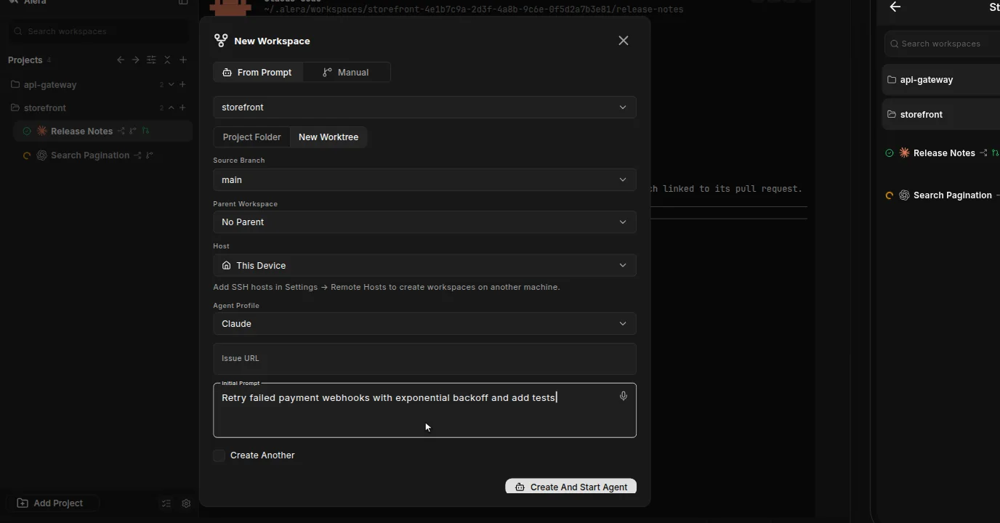
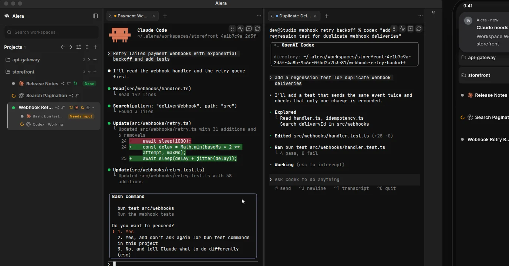
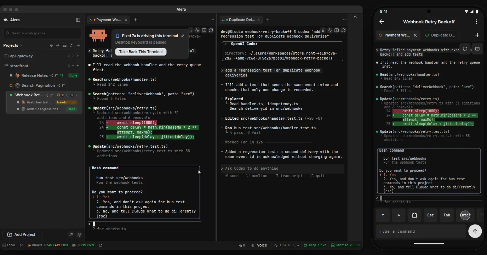
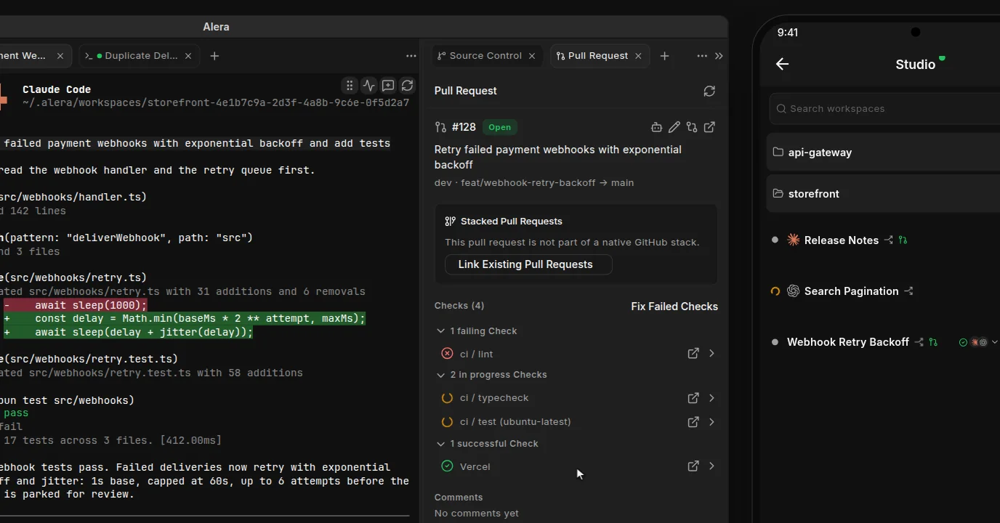
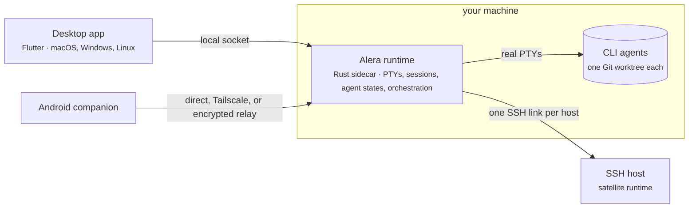

<p align="center">
  <a href="https://alera.build">
    <picture>
      <source media="(prefers-color-scheme: dark)" srcset="assets/logo/alera-logo-white.png">
      
    </picture>
  </a>
</p>

<h1 align="center">Alera</h1>

<p align="center"><strong>Run every CLI coding agent in parallel, each in its own Git worktree, from one native app.</strong></p>

<p align="center">
  <a href="LICENSE"></a>
  <a href="https://github.com/leynier/alera/releases/latest"></a>
  <a href="https://github.com/leynier/alera/actions/workflows/pr.yml"></a>
  <a href="https://github.com/leynier/alera"></a>
</p>

<p align="center">
  <a href="https://alera.build">Website</a> ·
  <a href="https://alera.build/docs">Docs</a> ·
  <a href="https://alera.build/download">Download</a> ·
  <a href="https://alera.build/blog">Blog</a> ·
  <a href="roadmap.md">Roadmap</a> ·
  <a href="https://github.com/leynier/alera/releases">Releases</a>
</p>

---

Alera is a desktop workbench for CLI coding agents. Every agent that runs in a terminal, from Claude Code and Codex to Amp, Cursor, and OpenCode, gets a real terminal in its own Git worktree, and Alera keeps track of which one is working, which one is done, and which one is waiting for you.

It is built with Flutter and Rust for macOS, Windows, and Linux, with no Electron and no bundled browser. A Rust runtime owns every terminal, so agents keep running when you close the window, and the Android companion can answer one from anywhere.

<p align="center">
  <a href="https://alera.build/#product"></a>
</p>

<p align="center"><sub>Rendered frame by frame from the <a href="https://alera.build/#product">interactive demo</a> on alera.build, which redraws both apps from their own tokens, icons, and copy. It is not a screen recording, and the agent sessions are staged samples.</sub></p>

```bash
curl -fsSL https://alera.build/install.sh | sh          # Linux: Ubuntu 24.04+, Debian 13+, Fedora
brew tap leynier/tap && brew install --cask alera       # macOS 14+ on Apple Silicon
```

On Windows, `scoop install leynier/alera` after `scoop bucket add leynier https://github.com/leynier/scoop-bucket`, or `choco install alera`. Every channel, the manual downloads, and the Android APK are on the [download page](https://alera.build/download).

**Contents:** [Why Alera](#why-alera) · [See It Work](#see-it-work) · [How It Works](#how-it-works) · [Supported Agents](#supported-agents) · [What You Get](#what-you-get) · [Install](#install) · [Documentation](#documentation) · [Developing](#developing) · [Releases And Updates](#releases-and-updates) · [Community](#community)

---

## Why Alera

Most AI IDEs wrap one chat backend in an Electron shell: slow to start, heavy on memory, tied to one provider, and busy with one task at a time. Alera takes the other bet.

- **Bring your own agent.** Alera is terminal-first. Every CLI agent runs in a real PTY, the way it was built to run. There is no chat layer of ours in between and no provider lock-in.
- **Run many at once.** Each task gets its own Git worktree, tabs, and terminals, so Claude, Codex, Amp, and the rest work in parallel without touching each other's files.
- **See who needs you.** Opt-in status hooks tell Alera when an agent is working, waiting for input, blocked, or done. The sidebar, the tab, the tray badge, and your phone all show it.
- **Sessions outlive the window.** Close the window and Alera keeps running in the tray with your agents. Quit it and it asks before stopping terminals that still have work, so you can leave the runtime open and come back to the same terminals, scrollback, and layout.
- **Native, not a web page.** Flutter for the interface, Rust for terminals, processes, and Git, and a maintained fork of the xterm2 emulator for parsing and drawing terminal output. No Electron, no embedded Chromium, no Node runtime.
- **Know what it costs.** The status bar shows each provider's remaining quota and a Resource Manager that attributes CPU and memory to every project, workspace, and terminal.

## See It Work

<table>
  <tr>
    <td width="50%"><a href="https://alera.build/#product"></a></td>
    <td width="50%"><a href="https://alera.build/#product"></a></td>
  </tr>
  <tr>
    <td><strong>Start From A Prompt.</strong> Describe a task once. Alera names the workspace, creates its Git worktree, and starts the agent there.</td>
    <td><strong>Agents In Parallel.</strong> Split the pane and start a second agent beside the first, in the same worktree.</td>
  </tr>
  <tr>
    <td><a href="https://alera.build/#product"></a></td>
    <td><a href="https://alera.build/#product"></a></td>
  </tr>
  <tr>
    <td><strong>Answer From Your Phone.</strong> The paired Android phone gets the push. One tap opens the same terminal, live.</td>
    <td><strong>Review And Ship.</strong> Stage, let AI Assist write the commit message, publish the branch, and open the pull request with its checks.</td>
  </tr>
</table>

## How It Works



1. **Register a project.** Add a local folder or clone a Git repository. Open as many workspaces on it as you need, and give each one its own worktree when the project uses Git.
2. **Open a workspace per task.** Each workspace can be its own Git worktree: one branch, one task. Describe it in a prompt and Alera names it and starts the agent.
3. **Run agents side by side.** Launch any CLI in real terminals, split them, and follow who is working and who needs you from the sidebar or your phone.

The desktop app and the phone are windows onto the runtime, which is why sessions survive closing the window. A remote host runs its own runtime, so terminals, files, search, and Git for a workspace there run where the code lives. See [`docs/architecture.md`](docs/architecture.md) for the full picture.

## Supported Agents

Alera works with any CLI agent. These ship with first-class support today: icons, launch profiles, resume, and live states through opt-in status hooks.

<p>
  <a href="https://docs.anthropic.com/claude/docs/claude-code"><kbd> Claude Code</kbd></a>&nbsp;
  <a href="https://github.com/openai/codex"><kbd> Codex</kbd></a>&nbsp;
  <a href="https://ampcode.com/manual#install"><kbd> Amp</kbd></a>&nbsp;
  <a href="https://antigravity.google/docs/cli-overview"><kbd> Antigravity</kbd></a>&nbsp;
  <a href="https://opencode.ai/docs/cli/"><kbd> OpenCode</kbd></a>&nbsp;
  <a href="https://cursor.com/cli"><kbd> Cursor</kbd></a>&nbsp;
  <a href="https://docs.github.com/en/copilot/how-tos/set-up/install-copilot-cli"><kbd> GitHub Copilot</kbd></a>&nbsp;
  <a href="https://pi.dev"><kbd> Pi</kbd></a>&nbsp;
  <a href="https://x.ai/cli"><kbd> Grok Build</kbd></a>&nbsp;
  <a href="https://fx.sh"><kbd> fx</kbd></a>
</p>

Anything else that runs in a terminal (Gemini CLI, Goose, Kimi, Crush, Aider, your own scripts) works as a plain terminal. See [CLI Agents](https://alera.build/docs/agents).

## What You Get

| Area | What ships today | Docs |
|---|---|---|
| **Projects and worktrees** | Projects from local folders or cloned repositories. Workspaces backed by Git worktrees, created from a source branch or an existing one, or from a prompt that names the workspace and starts the agent. Sections, pins, tags, sleep, and archive. | [Worktrees](https://alera.build/docs/worktrees) · [`alera.toml`](https://alera.build/docs/alera-toml) |
| **Terminals** | Tabs and splits of real PTYs owned by the Rust runtime, terminal search, themes, and sessions that persist across app restarts. | [Projects And Workspaces](https://alera.build/docs/projects#what-lives-in-a-workspace) |
| **Agent states** | Working, waiting, blocked, and done for every agent run, in the sidebar, the tab, the tray badge, and on the phone. Agent profiles with a starting prompt, and resume of an agent's own conversation. | [CLI Agents](https://alera.build/docs/agents) |
| **Files and search** | Explorer, search and replace across the workspace, Quick Open (`Mod+P`), the Command Palette (`Mod+Shift+P`), and previews for Markdown, PDF, Mermaid, and images. | |
| **Source control** | Staged and unstaged changes as a tree, diffs side by side or unified, stage, commit, amend, stash, and discard, a history graph, and AI Assist commit messages. | |
| **Pull requests** | Create, edit, comment, and merge on GitHub, GitLab, and Azure DevOps, with checks grouped by status, GitHub stacks, linked issues, and Watch and Fix handing failures back to an agent. | |
| **Coordination** | Orchestration between agents with coordinator runs, task ownership, decision gates, and messaging, plus scheduled automations. | [Orchestration](https://alera.build/docs/orchestration) |
| **Remote and mobile** | Workspaces on SSH hosts, the Android companion with push when an agent needs you, and optional accounts. | [Mobile Companion](https://alera.build/docs/mobile) |
| **Usage** | Remaining quota for Claude Code and CCS profiles, Codex, Kimi Code, Grok Build, Cursor, Antigravity, MiniMax, Z.ai, and OpenCode Go and Zen, and the Resource Manager. | [Quotas And Resources](https://alera.build/docs/quotas) |
| **Dictation** | Dictate into terminals, prompts, commit messages, and pull request fields with local Whisper models, an OpenAI-compatible transcription API, or a Codex subscription. | |

Everything account-related is optional: every local feature works without signing in. The [roadmap](roadmap.md) lists what is shipped, partial, and planned.

## Install

### Linux

Alera installs from a signed package repository so GTK and related system libraries resolve through your package manager. The same command installs and updates:

```bash
curl -fsSL https://alera.build/install.sh | sh
```

The script detects apt or dnf, verifies the repository signing key against a fingerprint pinned inside the script, configures the repository, and installs the package. Pass `--dry-run` to see what it would do, or `--repo-only` to configure the repository without installing.

Requires x86_64 and Ubuntu 24.04 or newer, Debian 13 or newer, or Fedora. openSUSE is not supported yet: the published RPM declares Fedora dependency names that openSUSE provides under different names.

To add the repository by hand instead, see the manual setup on the [download page](https://alera.build/download). The signing key is published at `https://updates.alera.build/linux/alera-archive-keyring.asc` with fingerprint `5DE97E7CFE234A1C5869EC54708DA940734CF23A`.

On a distribution with no package of ours, download `alera-<version>-linux-x64.tar.gz` from [GitHub Releases](https://github.com/leynier/alera/releases) and extract it somewhere you own, such as `~/.local/share/alera`. Install `gtk3` and the Vulkan loader through your own package manager first, since a tarball declares no dependencies.

### macOS

```bash
brew tap leynier/tap
brew install --cask alera
```

Requires Apple Silicon and macOS 14 or newer. The cask clears the quarantine attribute after installing, because the macOS build is not notarized yet. Or download `alera-<version>-macos.tar.gz` from [GitHub Releases](https://github.com/leynier/alera/releases) and move `Alera.app` to `/Applications`.

### Windows

```powershell
scoop bucket add leynier https://github.com/leynier/scoop-bucket
scoop install leynier/alera
```

```powershell
choco install alera
```

Requires 64-bit Windows. Or download `alera-<version>-windows.zip` from [GitHub Releases](https://github.com/leynier/alera/releases) and extract it anywhere.

### Android

The companion is one arm64 APK for 64-bit Android phones, published as `alera-<version>-android.apk` on the [mobile releases](https://github.com/leynier/alera/releases?q=mobile&expanded=true). Pair it from **Settings → Mobile Devices** on the desktop; see [Mobile Companion](https://alera.build/docs/mobile).

### Updating

Alera checks for a release every 15 minutes while its window is visible. How an update is applied depends on who owns the installation:

- **Direct downloads on macOS and Windows** update themselves after verifying the signed manifest and the artifact's SHA-256.
- **A Linux tarball** replaces its own directory, but only after Alera proves it can write there.
- **Homebrew and Scoop** update through that package manager: **Settings → Updates** runs its upgrade after Alera closes, then reopens the app.
- **Linux packages and Chocolatey** need elevated permissions, so **Settings → Updates** shows the upgrade command to copy, or to run with **Run Update** in a terminal inside Alera, where you can answer a prompt such as the `sudo` password.

Local development builds never update themselves.

### Code Signing Policy

Free code signing provided by SignPath.io, certificate by SignPath Foundation.

[SignPath.io](https://about.signpath.io) runs the signing service and the [SignPath Foundation](https://signpath.org) issues the certificate to open source projects at no cost.

Alera is maintained by one person, who fills every role: Leynier Gutiérrez González is the sole committer, reviewer, and approver of signing requests. Data handling is described in the [Privacy Policy](https://alera.build/privacy).

Current status: Linux packages are distributed through a repository whose metadata is signed with the key above. Windows and macOS builds are not signed yet, so Windows SmartScreen reports an unknown publisher and macOS Gatekeeper asks you to allow the app explicitly. Windows signing through SignPath begins once the certificate is issued.

### Run From Source

Alera is a Flutter desktop app. Use Flutter 3.47.2 or newer with Dart 3.13.2 or newer; CI is pinned to Flutter 3.47.2. You also need a working Rust toolchain (`rustup`), [Zig](https://ziglang.org/download/) 0.16.0, Git, and the native compiler toolchain for your desktop platform. The Rust workspace under `rust/` provides both the terminal-host sidecar (`alera-cli`) and the native layer (`alera_native`, compiled into the app through `flutter_rust_bridge`). Zig builds the vendored `ghostty_vte` terminal engine from its submodule.

Linux source builds also need system development packages: install the [Ubuntu and Debian prerequisites](.github/CONTRIBUTING.md#local-setup) first.

```bash
git clone https://github.com/leynier/alera.git
cd alera
make init-submodules
flutter pub get

# Pick your platform:
flutter run -d macos
flutter run -d windows
flutter run -d linux
```

On Windows, install Visual Studio 2022 with the **Desktop development with C++** workload and a Windows 10 or 11 SDK, Flutter 3.47.2 or newer, Git for Windows, and Rustup, then run the idempotent setup from PowerShell. It verifies the toolchain, enables Git long paths, installs Zig and LLVM through Scoop or WinGet when asked, repairs the required submodules, resolves packages, and runs the native-asset preflight:

```powershell
pwsh -File tool/development/setup_windows.ps1 -InstallMissingTools
flutter run -d windows
```

Use `-CheckOnly` to diagnose a machine without changing it. The first Ghostty build can compile for several minutes without output; later builds reuse the native-asset cache.

A local build runs as **Alera Dev** (`dev.leynier.alera.dev`) so it can live next to an installed release without sharing user data; set `ALERA_FLAVOR=release` to build the release identity. The repository `makefile` has the debug workflows (`make help` lists them), and `make frb-generate` regenerates the `flutter_rust_bridge` bindings after a change to `rust/src/api`.

## Documentation

| | |
|---|---|
| **Using Alera** | [Get started](https://alera.build/docs) · [Install](https://alera.build/docs/install) · [Projects and workspaces](https://alera.build/docs/projects) · [Worktrees](https://alera.build/docs/worktrees) · [`alera.toml`](https://alera.build/docs/alera-toml) · [CLI agents](https://alera.build/docs/agents) · [Orchestration](https://alera.build/docs/orchestration) · [Mobile companion](https://alera.build/docs/mobile) · [Quotas and resources](https://alera.build/docs/quotas) |
| **Architecture** | [`docs/architecture.md`](docs/architecture.md) · [`docs/remote-hosts-hub.md`](docs/remote-hosts-hub.md) · [`docs/orchestration.md`](docs/orchestration.md) · [`docs/agent-status-hooks.md`](docs/agent-status-hooks.md) · [`docs/performance.md`](docs/performance.md) |
| **Contributing** | [`AGENTS.md`](AGENTS.md) · [`.github/CONTRIBUTING.md`](.github/CONTRIBUTING.md) · [`docs/testing.md`](docs/testing.md) · [`docs/ui-styleguide.md`](docs/ui-styleguide.md) · [`docs/landing-demo.md`](docs/landing-demo.md) |
| **Trust** | [`docs/release-trust.md`](docs/release-trust.md) · [`SECURITY.md`](SECURITY.md) · [Privacy Policy](https://alera.build/privacy) |

## Repository Layout

| Path | What it is |
|---|---|
| `lib` | The Flutter desktop app: `app` bootstrap and theme, `features` by domain, `design_system` components, `shared` infrastructure |
| `rust` | The Cargo workspace: `alera_native` (the desktop app's native layer), `alera-core` (rules the app and the runtime share), `alera-cli` (the `alera` runtime and CLI), `alera_mobile_native` (on-device dictation for the phone), and `alera-xtask` (makefile tooling) |
| `mobile` | The Android companion app |
| `packages` | Dart packages shared by the desktop and mobile apps |
| `third_party` | Forked and vendored dependencies, including the terminal engine |
| `macos`, `windows`, `linux` | The native runner for each desktop platform: window, tray, and the build hooks that compile the runtime |
| `landing` | The Astro website: [alera.build](https://alera.build), the docs, the blog, and the product demo |
| `cloud`, `edge`, `infra/production` | The optional account and push service, the Cloudflare Worker in front of it, and its OpenTofu resources |
| `skills` | Agent skills Alera installs for the `alera` CLI and orchestration |
| `tool` | CI, release, and development scripts |
| `docs` | Contributor documentation |

## Developing

Start with [`AGENTS.md`](AGENTS.md), which holds the rules every change follows, and [`.github/CONTRIBUTING.md`](.github/CONTRIBUTING.md) for local setup. The common checks:

```bash
flutter analyze
flutter test --coverage --exclude-tags golden
make rust-test
```

Use `flutter test --tags golden` for visual regression tests and `flutter test integration_test -d macos` for desktop end-to-end coverage; [`docs/testing.md`](docs/testing.md) has the full workflow. The website builds from `landing/` with `bun run check`.

Alera builds in two flavors selected by `ALERA_FLAVOR`:

| Flavor | Bundle ID | Display name | Notes |
|---|---|---|---|
| `dev` | `dev.leynier.alera.dev` | Alera Dev | Default for local builds. Auto-update disabled. |
| `release` | `dev.leynier.alera` | Alera | Used by CI and public release artifacts. |

User data lives in `~/Library/Application Support/<bundle id>` on macOS, `$XDG_DATA_HOME/<bundle id>` (default `~/.local/share`) on Linux, and `%APPDATA%\dev.leynier\<display name>` on Windows. [`lib/src/core/build_flavor.dart`](lib/src/core/build_flavor.dart) holds the canonical strings.

## Releases And Updates

Release cuts are maintainer-run through GitHub Actions, and publish drafts first, verify every asset and update manifest, and only then go public. Update indexes use schema v3: each platform's `release.json` is signed with Ed25519 and commits to the artifact's SHA-256, which the app verifies before installing anything.

- Stable index: `https://updates.alera.build/updates/stable/app-archive.json`
- Release-candidate index: `https://updates.alera.build/updates/rc/app-archive.json`
- Stable Linux packages come from the signed APT and RPM repositories under `https://updates.alera.build/linux/`
- [GitHub Releases](https://github.com/leynier/alera/releases) remain the manual download surface

See [`docs/release-trust.md`](docs/release-trust.md) for signing, the Linux repositories, and manifest verification.

## Acknowledgements

Alera stands on brilliant work in the agentic development and terminal space:

- **[Orca](https://github.com/stablyai/orca)**: the primary inspiration for worktree-oriented, multi-agent product thinking
- **[Ghostty](https://ghostty.org/)**: the bar for fast, high-quality terminals
- **[xterm2](https://github.com/leynier/xterm2)** and **[xterm.js](https://xtermjs.org/)**: the terminal emulator Alera draws with, through a maintained fork, and the reference for terminal compatibility
- **[Flutter](https://flutter.dev/)**: the foundation of the cross-platform desktop and mobile apps
- **[Drift](https://drift.simonbinder.eu/)** and **[desktop_updater](https://pub.dev/packages/desktop_updater)**: local persistence and desktop update plumbing

Reference projects under [`reference_projects/`](reference_projects/) are reading material for agentic development patterns; Alera does not depend on any of them at runtime.

## Community

- [Open an issue](https://github.com/leynier/alera/issues) for a bug or a feature request, and star the repository to follow along.
- Report vulnerabilities privately as described in [`SECURITY.md`](SECURITY.md).
- Read the [Code of Conduct](CODE_OF_CONDUCT.md) before taking part.

## License

[MIT](LICENSE).
